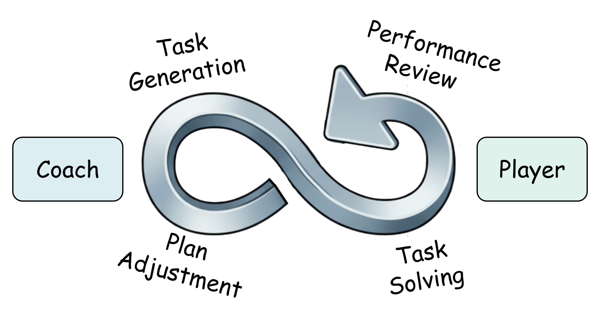
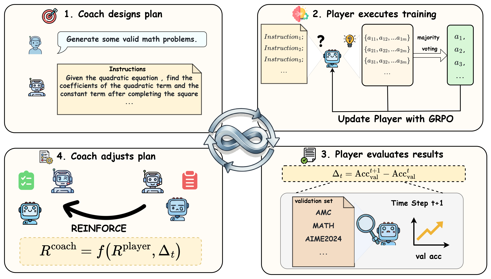

# *CPMöbius*: Iterative Coach–Player Reasoning for Data-Free Reinforcement Learning

<!-- > Train LLMs to reason and evolve on their own, starting with nothing but a base model. No data required. -->

<p align="center">
  <a href="https://arxiv.org/pdf/2602.02979">
    
  </a>
  <a href="https://github.com/thunlp/CPMobius">
    
  </a>
</p>



> A collaborative alternative to self-play. Teach Large Language Models to reason without any external training data through a Coach that proposes targeted instructions and a Player that learns by solving them.

<!-- Check out our [paper](https://arxiv.org/abs/2602.02979) for the full details. -->

<!-- ## 🔥 Updates

* `[2026-02-04]` We released our [paper](https://arxiv.org/abs/2602.02979) and code on arXiv (2602.02979).
* `[2026-02-03]` v1 of CPMöbius submitted to arXiv.
* `[2025-10]` CPMöbius submitted to **ICLR 2026** for review. -->

## 🏴󠁶󠁵󠁭󠁡󠁰󠁿 Overview

Training strong reasoning LLMs traditionally depends on massive, human-curated tasks and labels — through SFT or RL on reasoning-specific data. This dependence is increasingly unsustainable, and the diminishing returns of supervision-heavy paradigms are already visible in practice.



[**CPMöbius**](https://arxiv.org/abs/2602.02979) breaks this dependence with a **collaborative Coach–Player paradigm** for data-free reinforcement learning of reasoning models. Unlike adversarial self-play (e.g., R-Zero, AZR), CPMöbius — inspired by real-world sports coaching and multi-agent collaboration — treats the Coach and Player as **independent but cooperative** roles:

1. **The Coach 🧭** proposes instructions targeted at the Player's *current* capability and is rewarded based on **changes in the Player's performance**, not on beating the Player.
2. **The Player ⚽** is rewarded for solving the increasingly instructive tasks generated by the Coach.

This forms a Möbius-like cooperative optimization loop: the Coach learns *what* the Player needs next, and the Player learns *how* to solve it — with no external problem set, no human labels, and no adversarial pressure.

### Key Features

* **Fully Data-Free.** No external problems, no annotated solutions, no SFT warm-up on reasoning data.
* **Collaborative.** The Coach is rewarded for the Player's *improvement*, sidestepping the instability and reward hacking that plague competitive self-play.
* **Adaptive Curriculum.** Tasks that are generated by the coach are continuously calibrated to the Player's evolving frontier, keeping problems neither too easy nor too hard.
* **Flexible Environment Feedback.** AMC is not the only held-out validation set that can provide environment feedback; other validation sets such as AIME, Minerva, and OlympiadBench can also be used.
* **Outperforms Unsupervised Baselines.** Almost  outperforms RENT on overall accuracy and R-Zero on OOD accuracy under matched settings.

---

## ⚡️ Quick Start

### 1. Set up the environment

```bash
git clone https://github.com/thunlp/CPMobius.git
cd CPMobius

conda env create -f env.yml
conda activate cpmobius
```


### 2. Configure training paths

Before running the main training script, edit `scripts/run_qwen2.5-math-1.5b_amc.sh` and set the following values:

```bash
# if you use wandb instead of swanlab, set export WANDB_API_KEY='Your Wandb API Key' and change trainer.logger=['console','swanlab'] to trainer.logger=['console','wandb'] in the script. Also change SWANLAB_LOG_DIR to WANDB_LOG_DIR

export SWANLAB_API_KEY='Your Swanlab API Key'

SWANLAB_LOG_DIR='Your Swanlab Log Directory'
VAL_FILES="Your path to validation parquet file"
PLAYER_MODEL_PATH="Your path to Qwen2.5-Math-1.5B"
COACH_MODEL_PATH="Your path to coach model"
CKPT_DIR="Your Checkpoint Directory"
```

### 3. Run the full Coach–Player loop

```bash
bash scripts/run_qwen2.5-math-1.5b_amc.sh
```

The script runs the Coach–Player training loop and saves checkpoints under `CKPT_DIR`.

## 🤗 Converting checkpoints
```bash
bash utils/convert.sh <path_to_your_checkpoint1> <path_to_your_checkpoint2> ...
```

---

## 📊 Results

CPMöbius is evaluated on a suite of mathematical reasoning benchmarks, with both **in-distribution (ID)** and **out-of-distribution (OOD)** averages reported. We select four base models for our training experiments, representing the three main stages of a typical LLM training lifecycle: pre-training, supervised fine-tuning (SFT), and reinforcement learning.

**Performance comparison between CPMöbius and baseline methods on mathematical reasoning benchmarks.** *Overall Average* is the mean over all benchmarks. *OOD Average* is the mean over all benchmarks **except AMC**, because RENT was trained on AMC and CPMöbius validation also used AMC — separating it gives a fair in-distribution (AMC) vs. out-of-distribution comparison. **Bold** values indicate the best performance for each metric.

| Models | Average | OOD Average | AMC | AIME 2024 | AIME 2025 | Minerva | MATH | Olympiad |
| --- | --- | --- | --- | --- | --- | --- | --- | --- |
| ***Qwen2.5-Math-1.5B*** | | | | | | | | |
| Base Model | 23.3 | 19.8 | 34.6 | 6.2 | 2.8 | 16.3 | 56.2 | 23.4 |
| R-Zero (Iter 3) | 27.1 | 24.7 | 39.2 | 9.8 | 5.0 | 19.3 | 62.4 | 26.8 |
| RENT | 27.1 | 24.7 | 39.3 | **10.0** | 5.0 | 19.0 | 62.2 | **27.1** |
| ***CPMöbius*** | **28.8** | **26.8** | **39.4** | 9.8 | **5.4** | **28.0** | **63.1** | 26.9 |
| ***OpenMath-Nemotron-1.5B*** | | | | | | | | |
| Base Model | 59.5 | 54.9 | 82.3 | **55.6** | 43.3 | **25.1** | 89.4 | 61.0 |
| R-Zero (Iter 3) | – | – | – | – | – | – | – | – |
| RENT | 61.7 | 56.5 | **87.7** | 55.0 | 46.0 | 24.2 | 90.7 | 66.7 |
| ***CPMöbius*** | **62.1** | **57.0** | 87.5 | 54.9 | **46.9** | 24.3 | **91.2** | **67.9** |
| ***OctoThinker-3B-Hybrid-Zero*** | | | | | | | | |
| Base Model | 21.3 | 20.6 | 24.6 | 3.9 | 1.7 | 16.3 | 57.9 | 23.4 |
| R-Zero (Iter 3) | 20.5 | 19.5 | 25.9 | 2.0 | 0.3 | 14.6 | 58.1 | 22.3 |
| RENT | 23.0 | 21.7 | **29.2** | **7.3** | **2.1** | 15.0 | 60.2 | 24.1 |
| ***CPMöbius*** | **23.6** | **22.0** | 28.0 | 4.8 | 1.7 | **22.1** | **60.4** | **24.7** |
| ***Qwen2.5-Math-7B-Instruct*** | | | | | | | | |
| Base Model | 35.8 | 33.0 | 49.2 | 9.0 | 6.3 | 34.6 | 78.0 | 37.4 |
| R-Zero (Iter 3) | 36.9 | 34.2 | 50.5 | 9.5 | 7.4 | 32.7 | 83.3 | 38.1 |
| RENT | 39.2 | 37.6 | 53.1 | 10.8 | **9.9** | 38.8 | 83.8 | **38.8** |
| ***CPMöbius*** | **40.7** | **38.4** | **55.6** | **11.8** | 9.6 | **44.9** | **84.2** | 38.3 |

**Headline takeaways:**

* CPMöbius improves overall accuracy by **+4.9** on Qwen2.5-Math-7B-Instruct without any external data.
* On OOD benchmarks, CPMöbius gains **+5.4** exceeding R-Zero by **+4.2**.
* CPMöbius exceeds RENT by **+1.5** on overall accuracy, demonstrating that *targeted task generation* outperforms pure entropy minimization.

> Full per-benchmark numbers (MATH, AIME, AMC, OlympiadBench, College-Math, GaoKao, etc.) are in Section 5 of the [paper](https://arxiv.org/abs/2602.02979).

---

## ❓ FAQ 

### **Q: How is CPMöbius different from other self-play frameworks?**

**A:** R-Zero and AZR are both very excellent frameworks and they cast the question generator and the solver as **adversaries**, i.e., the generator is rewarded for finding problems the solver fails on. In contrast, CPMöbius is **collaborative**: the Coach is rewarded by the Player's *improvement* (a change-in-performance signal), so the Coach has no incentive to push the Player off a cliff. Empirically this yields a more stable curriculum, especially on OOD benchmarks.

### **Q: What does "data-free" actually mean here?**

**A:** It means CPMöbius does not consume any human-written reasoning problems or human-annotated solutions during the Coach–Player co-evolution loop. The base model and tokenizer are pretrained as usual, and the evaluation benchmarks remain held-out. No external math problem set (e.g., MATH train, NuminaMath, GSM8K) is used during training.

### **Q: How does the Coach receive reward without ground-truth labels?**

**A:** The Coach is rewarded based on **changes in the Player's performance** on a held-out probe set evaluated under self-consistency / majority-voting style pseudo-labels. This avoids the need for human labels while still giving the Coach a directional signal toward "instructive" task distributions. See Section 3 of the paper.

### **Q: Why is the framework called Möbius?**

**A:** The Coach–Player loop has no fixed "stronger" or "weaker" side the two roles co-evolve along a single continuous optimization trajectory, like a Möbius strip with no separate inside and outside.

---

## 🙏 Acknowledgements

Our RL training stack is built on [**veRL**](https://github.com/volcengine/verl). We utilize [vLLM](https://github.com/vllm-project/vllm) for rollouts. We use scripts from [PRIME](https://github.com/PRIME-RL/PRIME/tree/main/eval) for evaluation. We thank all of authors at THUNLP for their excellent work.

---

## 💬 Citation

If our work is useful for you, please consider citing the paper:

```bibtex
@article{li2026cpmobius,
  title={CPMobius: Iterative Coach-Player Reasoning for Data-Free Reinforcement Learning},
  author={Li, Ran and Liu, Zeyuan and Chen, Yinghao and He, Bingxiang and Yuan, Jiarui and Fu, Zixuan and Chen, Weize and Hu, Jinyi and Liu, Zhiyuan and Sun, Maosong},
  journal={arXiv preprint arXiv:2602.02979},
  year={2026}
}


```

<!-- ## ⭐ Star History

[](https://star-history.com/#<your-org>/CPMobius&Date) -->
